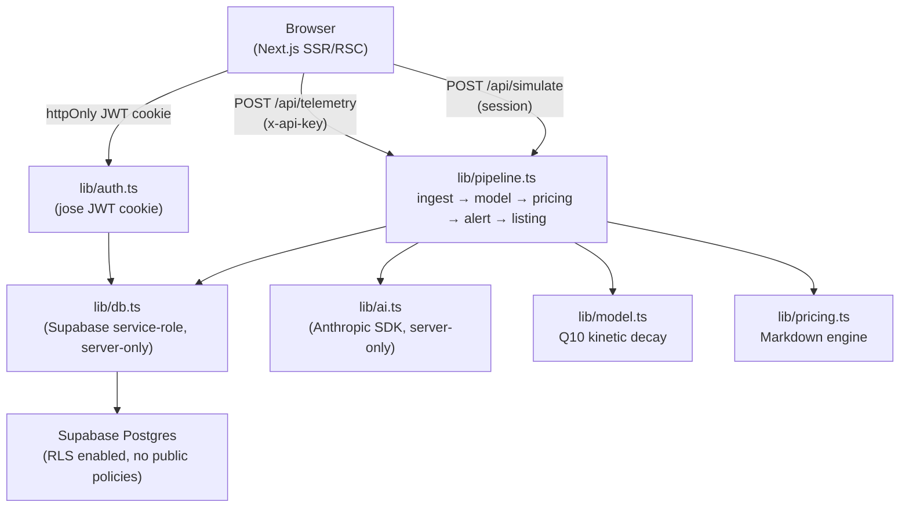

# AgroSense — Cold Chain Monitoring Platform

> **AgriTech Hackathon Submission** | Full-stack perishable cold-chain monitoring with real-time shelf-life computation, AI-powered markdowns, and spoilage-risk alerts.

---

## Problem

~30% of perishable produce is lost in refrigerated transit due to temperature fluctuations and slow reaction to delays. Distributors lack real-time insight into remaining shelf life, and retailers discover discounts too late to act.

## Solution

AgroSense ingests simulated IoT telemetry (temperature, humidity, transit time), computes **remaining shelf life in real time** using a Q10 kinetic decay model, and automatically publishes **dynamic markdown discounts** to local retailers before produce spoils — with spoilage-risk alerts via a live dashboard.

---

## Architecture



---

## Data Flow

```
Telemetry POST (x-api-key or simulate)
  │
  ▼
Pipeline:
  1. Validate readings (Zod)
  2. For each reading: Q10 burn → INSERT telemetry (append-only)
  3. UPDATE shipment (remaining, price, status, tier)
  4. Compute discount tier
  5. If tier changed/worsened: deactivate old listing → INSERT alert + listing (template)
  6. Async: Claude generates insight + retailer message → UPDATE listing/alert rows
```

---

## Shelf-Life Formula (Q10 Kinetic Decay)

```
burnRate = q10 ^ ((T - tRef) / 10)
humidityPenalty = max(0, (deviation outside band) × 0.02)
effectiveBurn = burnRate + humidityPenalty
remaining -= effectiveBurn × deltaHours
```

### Worked Example — 38°C Spike (Tomatoes)

Tomato profile: `tRef = 12°C`, `q10 = 2.5`

```
burnRate = 2.5 ^ ((38 - 12) / 10)
         = 2.5 ^ 2.6
         ≈ 10.77

For 19 readings × 0.5h each at 38°C:
  life lost = 19 × 0.5 × 10.77 ≈ 102.3h
  starting: 120h → remaining: ~17.7h ✅ (16-20h spec range)
```

---

## Pricing Tiers

| Condition | Discount | Severity | Action |
|---|---|---|---|
| remaining ≤ 18h | **−45%** | critical | Flash markdown |
| remaining ≤ 36h | **−28%** | warning | Markdown |
| remaining < 1.5 × needHours | **−12%** | info | Early markdown |
| else | 0% | — | Full price |

`needHours = eta_hours + 24` (transit + 24h retail sell-through buffer)

---

## Produce Profiles

| Produce | Base Life | tRef | Q10 | Humidity |
|---|---|---|---|---|
| 🍅 Tomato | 120h | 12°C | 2.5 | 85–95% |
| 🍌 Banana | 240h | 14°C | 2.2 | 85–90% |
| 🥬 Spinach | 72h | 2°C | 3.0 | 90–98% |
| 🍓 Strawberry | 48h | 2°C | 3.5 | 88–95% |

---

## Security Measures

| Measure | Implementation |
|---|---|
| No secrets in client | `import "server-only"` in db.ts, auth.ts, ai.ts; zero `NEXT_PUBLIC_` secrets |
| Hashed ingest keys | SHA-256, stored in DB; raw key printed once at seed time |
| httpOnly sessions | Signed JWT via jose, `httpOnly + secure + sameSite=lax` |
| Input validation | Zod schemas on every API route |
| Rate limiting | Postgres-backed 60 req/min per ingest key |
| RLS | Enabled on all tables, no public policies; service-role server-side only |
| Append-only telemetry | Postgres trigger blocks UPDATE/DELETE |
| Security headers | CSP, X-Frame-Options, Referrer-Policy, X-Content-Type-Options |
| Secret scan CI gate | `scripts/grep-secrets.sh` scans `.next/static` post-build |

---

## Environment Variables

```env
NEXT_PUBLIC_APP_URL=http://localhost:3000    # Only safe public var

SUPABASE_URL=https://xxxx.supabase.co       # Server-only
SUPABASE_SERVICE_ROLE_KEY=...               # Server-only
ANTHROPIC_API_KEY=sk-ant-...                # Server-only
ANTHROPIC_MODEL=claude-sonnet-4-5           # Optional, has default
SESSION_SECRET=...                          # 32+ random bytes
DISTRIBUTOR_PASSWORD=...
RETAILER_PASSWORD=...
```

---

## Setup & Run

### 1. Install dependencies
```bash
npm install
```

### 2. Configure environment
```bash
cp .env.example .env.local
# Fill in SUPABASE_URL, SUPABASE_SERVICE_ROLE_KEY, ANTHROPIC_API_KEY, SESSION_SECRET, passwords
```

### 3. Set up database
Run `supabase/schema.sql` in the Supabase SQL editor (Dashboard → SQL Editor → New query → paste → Run).

### 4. Seed demo data
```bash
npm run seed
# Copy the printed RAW INGEST KEY — shown only once!
```

### 5. Run locally
```bash
npm run dev
# Open http://localhost:3000
```

### 6. Run tests
```bash
npm test
```

### 7. Build + security check
```bash
npm run build
bash scripts/grep-secrets.sh   # should print "✅ No secrets found"
```

### 8. Deploy to Vercel
```bash
vercel --prod
# Set environment variables in Vercel dashboard
```

---

## API Reference

### POST /api/telemetry
```bash
curl -X POST http://localhost:3000/api/telemetry \
  -H "x-api-key: YOUR_RAW_INGEST_KEY" \
  -H "Content-Type: application/json" \
  -d '{
    "shipment_code": "AGS-101",
    "readings": [
      { "temp_c": 38, "humidity_pct": 90, "recorded_at": "2024-01-01T10:00:00Z" }
    ]
  }'
```

### POST /api/simulate (requires distributor cookie)
```bash
curl -X POST http://localhost:3000/api/simulate \
  -H "Cookie: agrosense-session=<token>" \
  -H "Content-Type: application/json" \
  -d '{ "shipment_id": "<uuid>", "scenario": "spike" }'
```

### GET /api/listings?since=<ISO>
```bash
curl http://localhost:3000/api/listings \
  -H "Cookie: agrosense-session=<retailer-token>"
```

---

## 3-Minute Demo Script

1. **(0:00)** Open `/login`. Click **Distributor** → enter password → sign in.
2. **(0:20)** Dashboard: AGS-101 Tomatoes, green gauge showing **5d (120h)**, full ₹40/kg.
3. **(0:40)** Click AGS-101 → Shipment detail: temp chart, model breakdown, route progress.
4. **(1:00)** Click **Simulate Spike (38°C)**. Watch 6-step progress animation.  
   → Gauge drains to ~18h · Status → CRITICAL · Price → ₹22/kg (−45%).
5. **(1:30)** Open a new incognito browser tab → `/login` → Retailer → sign in → `/marketplace`.  
   → Within 3s: **Flash markdown toast** appears: "−45%, 18h freshness left".  
   → Listing card appears with ₹40 strikethrough → ₹22.
6. **(2:00)** Hard-refresh both pages — all data persists.
7. **(2:20)** Show terminal curl tests (key=200, no key=401, bad payload=400).
8. **(2:45)** Click **Reset Demo** → gauge returns to 5d · price ₹40 · status In Transit.
9. **(3:00)** Show `npm test` green · `npm run build` clean.

---

## Design Decisions

| Decision | Choice | Rationale |
|---|---|---|
| No separate backend | Next.js Route Handlers | One deployment, fewer moving parts |
| Telemetry auth | SHA-256 hashed key | No plaintext secrets in DB |
| Session | httpOnly JWT via jose | Browser never sees secret |
| AI async pattern | Template first, AI updates | UI never blocks on AI |
| Rate limiting | Postgres table | No Redis required |
| Polling | 2s setInterval | Simple, no WebSocket complexity |
| Append-only telemetry | Postgres trigger | Audit trail, data integrity |
